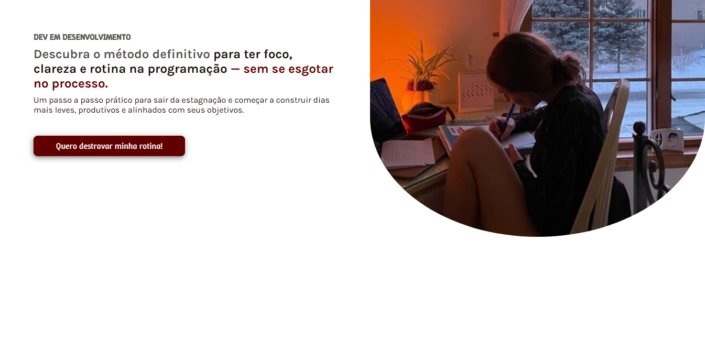

# 🚀 Dev em Desenvolvimento (DED) — Landing Page

> **⚠️ Importante:** Este projeto é **fictício** e foi criado apenas para fins de estudo, prática de desenvolvimento web e design de landing pages com foco em persuasão.

Este repositório contém o desenvolvimento de uma **landing page** para um infoproduto voltado à organização e produtividade de desenvolvedores(as), chamado **DED – Dev em Desenvolvimento**.

---

## 💡 Sobre o Projeto

A proposta foi criar uma página de vendas completa e funcional para um curso imaginário voltado a devs que enfrentam dificuldades em manter uma rotina organizada e produtiva. A estrutura, linguagem e estilo visual foram pensados para simular uma campanha real de marketing digital, com foco em copywriting emocional, provas sociais, detalhamento de módulos e CTA's estratégicas.

### 🎯 Objetivo

- Praticar construção de páginas longas e com foco em **alta conversão**
- Reforçar o uso de bibliotecas como AOS.js para animações
- Aprimorar o uso de HTML e CSS em estruturas longas e segmentadas
- Testar diferentes estilos de seções: hero, objeções, solução, aula, bônus, depoimentos, preço e FAQ

## ✨ Inspiração

Este projeto foi **inspirado na estrutura e estilo narrativo** da página da Luana Carolina para o infoproduto **RPE**:

🔗 [https://www.luanacarolinas.com.br/rpe-t001/ved-vagasabertas-a1](https://www.luanacarolinas.com.br/rpe-t001/ved-vagasabertas-a1)

A escolha foi feita pela clareza da narrativa, apelo emocional bem estruturado e uso eficiente de provas sociais e benefícios práticos.
(As ultimas imagens das "escadinhas" também foram tiradas da pagina dela)

## 🛠️ Tecnologias Utilizadas

- **HTML5**  
- **CSS3**  
- **[AOS.js](https://michalsnik.github.io/aos/)** para animações on scroll  
- **[Bootstrap Icons](https://icons.getbootstrap.com/)** para os ícones

## 📸 Funcionalidades da Página

- Seção Hero com chamada principal
- Objeções comuns da persona
- Apresentação da criadora (Maddu Silva)
- Protocolo de aulas e metodologia (DED)
- Benefícios detalhados do curso
- Seção de depoimentos simulando provas sociais
- Bônus e garantias
- FAQ com dúvidas frequentes

## 📎 Observações Finais

Este projeto **não representa um produto real** e foi idealizado apenas como exercício prático de design e desenvolvimento de landing pages. Todo o conteúdo (texto, imagens e personagens como "Maddu Silva") é fictício, criado com fins educativos e de portfólio.

---

💻 **Desenvolvido por:**  
Maddu Silva │ *Web Developer*
